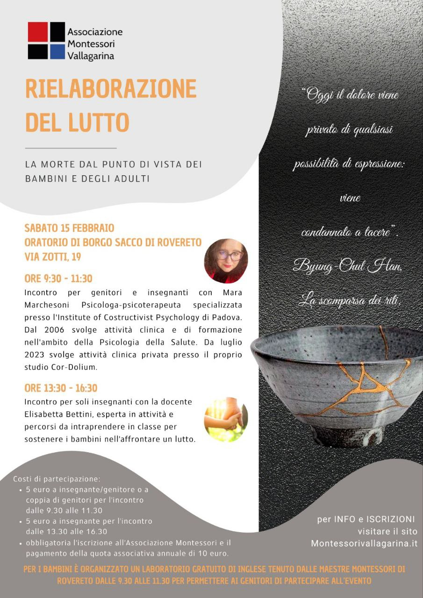

# Benvenuti

<span style="font-size: 24px;">Benvenuti sul sito dell'associazione Montessori Vallagarina. Siamo un gruppo di genitori, insegnanti e simpatizzanti che desiderano diffondere e promuovere le idee scientifico pedagogiche di **Maria Montessori**.</span>

<span style="font-size: 24px;">Crediamo in un'educazione che metta al centro il bambino, il suo rispetto e il suo sviluppo autonomo. Un'educazione che favorisca la curiosità, l'indipendenza e la scoperta, affinché ognuno possa crescere, imparare e **realizzare il proprio potenziale**.</span>

<span style="font-size: 24px;">Scopri le nostre proposte, contattaci per saperne di più.</span>


---

# Prossimi appuntamenti

## Rielaborazione del lutto
15 febbraio 2025



Per il pagamento della quota di partecipazione all'evento (5 o 10 euro in caso di iscrizione ad entrambi gli incontri) e la quota associativa fare due bonifici distinti con come causale rispettivamente *"Quota di partecipazione all'evento Rielaborazione del lutto - nome e cognome"* e *"Quota associativa anno 2025 - nome cognome"*.


```
Associazione Montessori Vallagarina
IBAN IT33O0801120800000033314717
```
