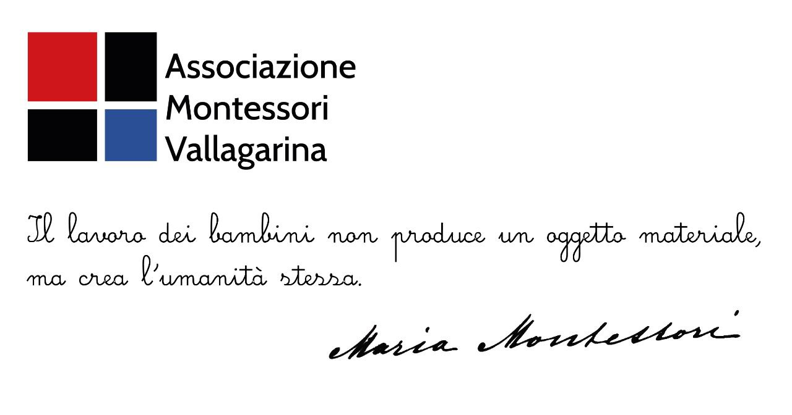
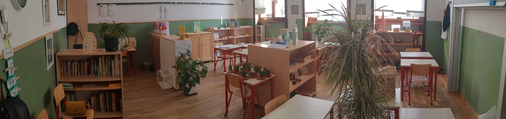

# Benvenuti

<span style="font-size: 24px;">Benvenuti sul sito dell'associazione Montessori Vallagarina. Siamo un gruppo di genitori, insegnanti e simpatizzanti che desiderano diffondere e promuovere le idee scientifico pedagogiche di **Maria Montessori**.</span>

<span style="font-size: 24px;">Crediamo in un'educazione che metta al centro il bambino, il suo rispetto e il suo sviluppo autonomo. Un'educazione che favorisca la curiosità, l'indipendenza e la scoperta, affinché ognuno possa crescere, imparare e **realizzare il proprio potenziale**.</span>

<span style="font-size: 24px;">Scopri le nostre proposte, contattaci per saperne di più.</span>



---

# Prossimi appuntamenti

## Giochi di circo per grandi e piccini al Bosco della Città con Oppetelà Circo Botanico

Sabato 19 settembre, 14.30-16.30

Ritrovo: parcheggio alto Bosco della Città di Rovereto

Genitori e bambini dai 5 anni possono giocare e divertirsi assieme

Abbigliamento comodo, scarpe da ginnastica e borraccia

Attività gratuita

Necessaria l'iscrizione di un genitore all'associazione Montessori Vallagarina (costo 10 euro) che garantisce la partecipazione anche ai futuri laboratori fino a dicembre.

<a href="https://forms.gle/29vQXyaX3vGcTU1q8" target="_blank">Clicca qui per prenotarsi all'attività</a>


```
Associazione Montessori Vallagarina
IBAN IT33O0801120800000033314717
```
