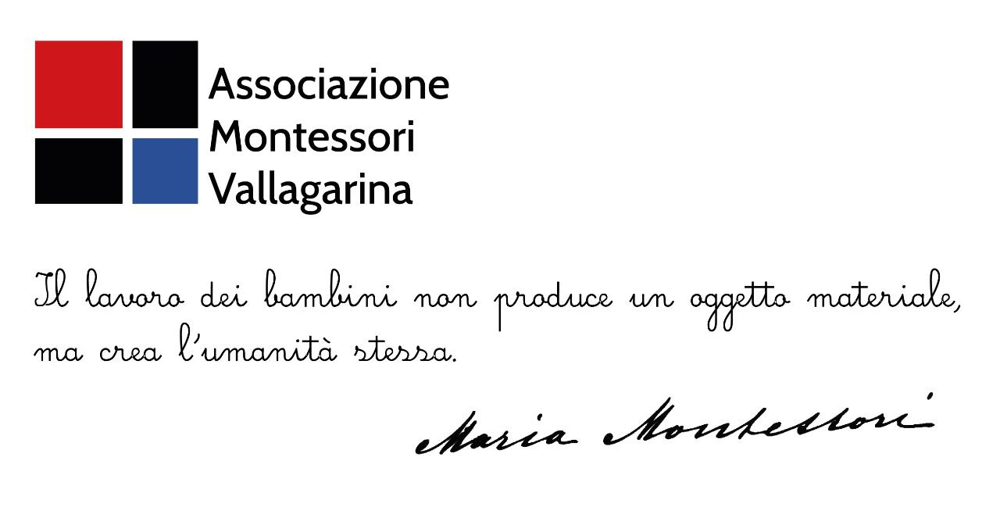
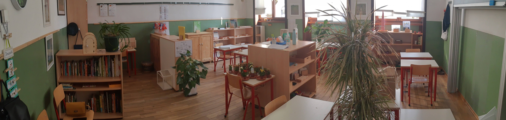
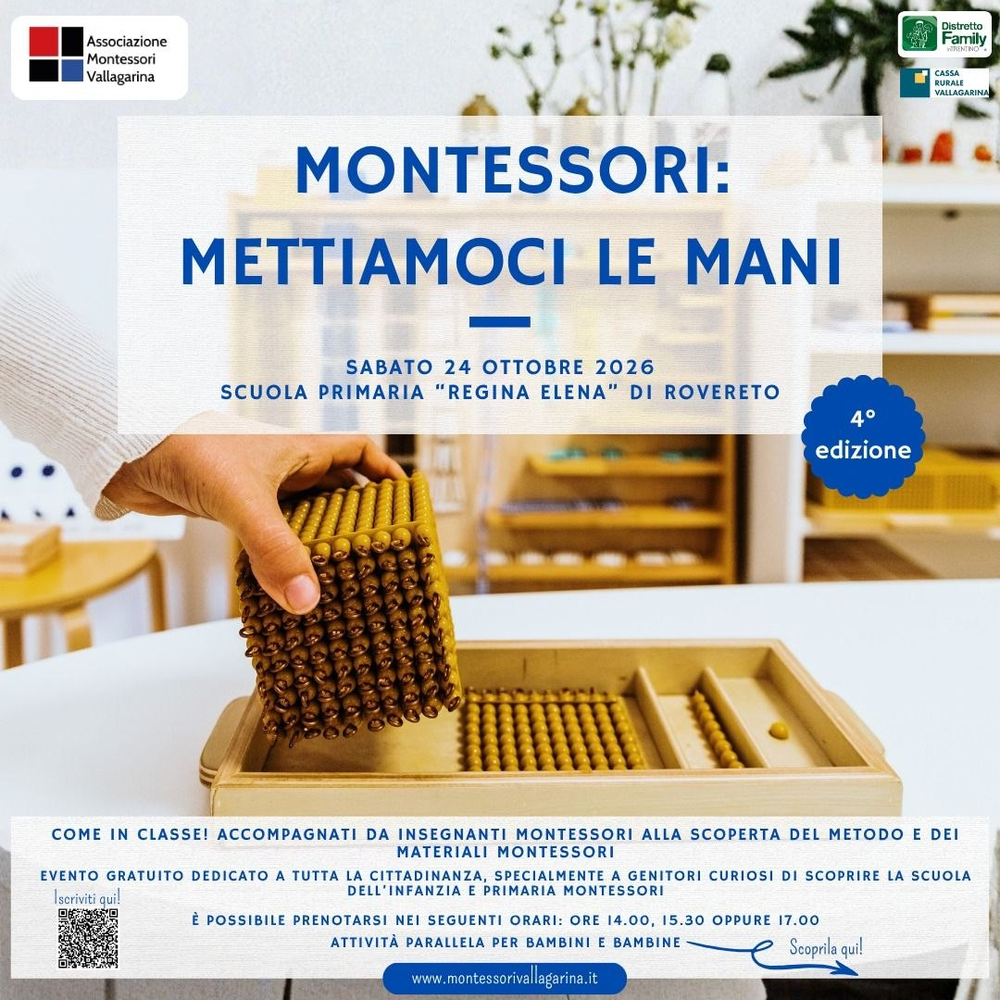
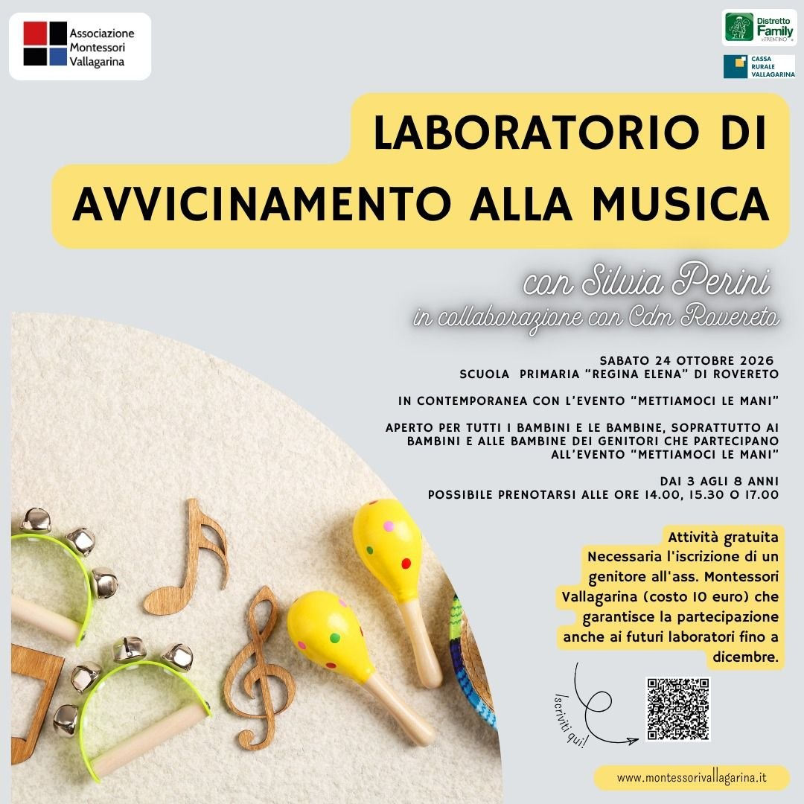

# Benvenuti

<span style="font-size: 24px;">Benvenuti sul sito dell'associazione Montessori Vallagarina. Siamo un gruppo di genitori, insegnanti e simpatizzanti che desiderano diffondere e promuovere le idee scientifico pedagogiche di **Maria Montessori**.</span>

<span style="font-size: 24px;">Crediamo in un'educazione che metta al centro il bambino, il suo rispetto e il suo sviluppo autonomo. Un'educazione che favorisca la curiosità, l'indipendenza e la scoperta, affinché ognuno possa crescere, imparare e **realizzare il proprio potenziale**.</span>

<span style="font-size: 24px;">Scopri le nostre proposte, contattaci per saperne di più.</span>



---

# Prossimi appuntamenti

## Montessori: mettiamoci le mani
24 ottobre 2026



<a href="https://forms.gle/y12WKLfauqktbm5o7" target="_blank">Clicca qui per prenotarsi all'attività</a>

## Laboratorio di avvicinamento alla musica
24 ottobre 2026



<a href="https://forms.gle/asuFKAuHkGRJhGrT8" target="_blank">Clicca qui per prenotarsi all'attività</a>

```
Associazione Montessori Vallagarina
IBAN IT33O0801120800000033314717
```
