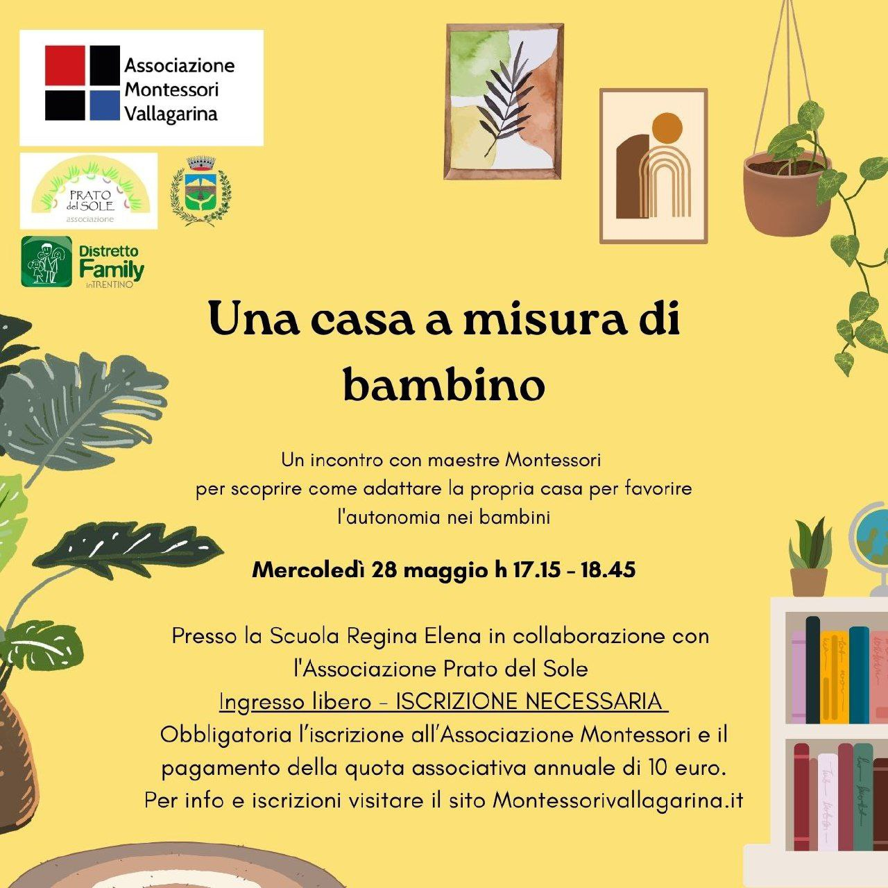

# Benvenuti

<span style="font-size: 24px;">Benvenuti sul sito dell'associazione Montessori Vallagarina. Siamo un gruppo di genitori, insegnanti e simpatizzanti che desiderano diffondere e promuovere le idee scientifico pedagogiche di **Maria Montessori**.</span>

<span style="font-size: 24px;">Crediamo in un'educazione che metta al centro il bambino, il suo rispetto e il suo sviluppo autonomo. Un'educazione che favorisca la curiosità, l'indipendenza e la scoperta, affinché ognuno possa crescere, imparare e **realizzare il proprio potenziale**.</span>

<span style="font-size: 24px;">Scopri le nostre proposte, contattaci per saperne di più.</span>


---

# Prossimi appuntamenti

[Clicca qui per iscriverti agli incontri](https://forms.gle/C4oZ2YyJpuHTMJuo7)

## Toccare un concetto
4 giugno 2025


## Una casa a misura di bambino
28 maggio 2025



## Pregiudizi e falsi miti
21 maggio 2025


```
Associazione Montessori Vallagarina
IBAN IT33O0801120800000033314717
```
