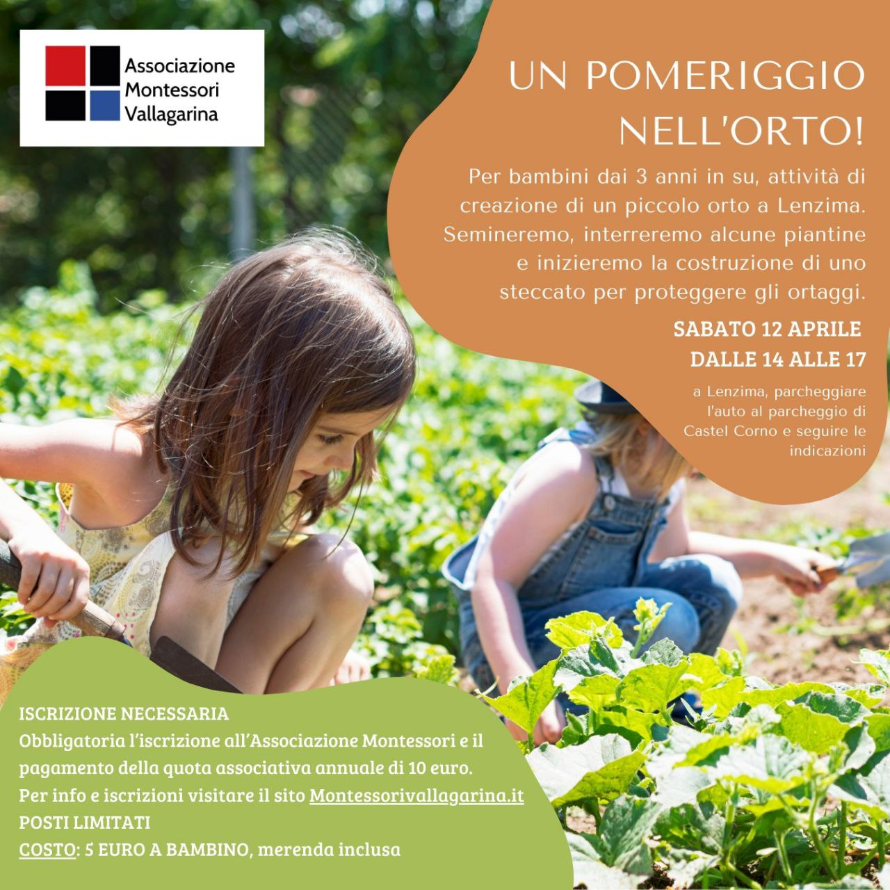

# Benvenuti

<span style="font-size: 24px;">Benvenuti sul sito dell'associazione Montessori Vallagarina. Siamo un gruppo di genitori, insegnanti e simpatizzanti che desiderano diffondere e promuovere le idee scientifico pedagogiche di **Maria Montessori**.</span>

<span style="font-size: 24px;">Crediamo in un'educazione che metta al centro il bambino, il suo rispetto e il suo sviluppo autonomo. Un'educazione che favorisca la curiosità, l'indipendenza e la scoperta, affinché ognuno possa crescere, imparare e **realizzare il proprio potenziale**.</span>

<span style="font-size: 24px;">Scopri le nostre proposte, contattaci per saperne di più.</span>


---

# Prossimi appuntamenti

## Un pomeriggio nell'orto
12 aprile 2025

**Iscrizione obbligatoria** - [Clicca qui](https://accorcia.to/426l) per iscriverti all'incontro.

[Clicca qui](adesione) per iscriverti all'Associazione Montessori Vallagarina (anno 2025).



```
Associazione Montessori Vallagarina
IBAN IT33O0801120800000033314717
```
